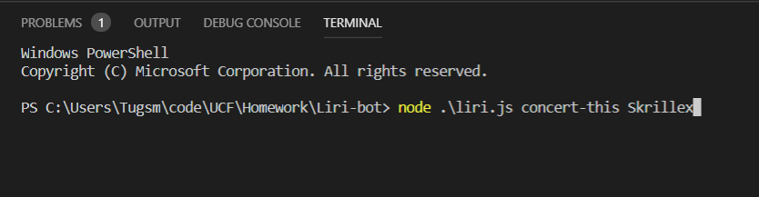
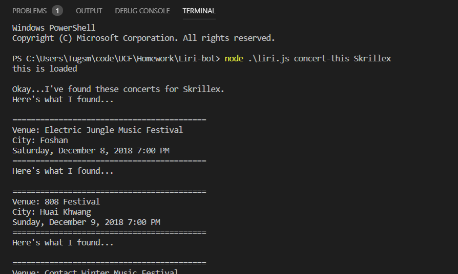
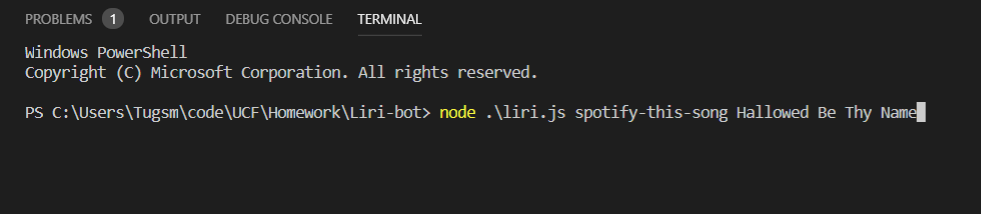
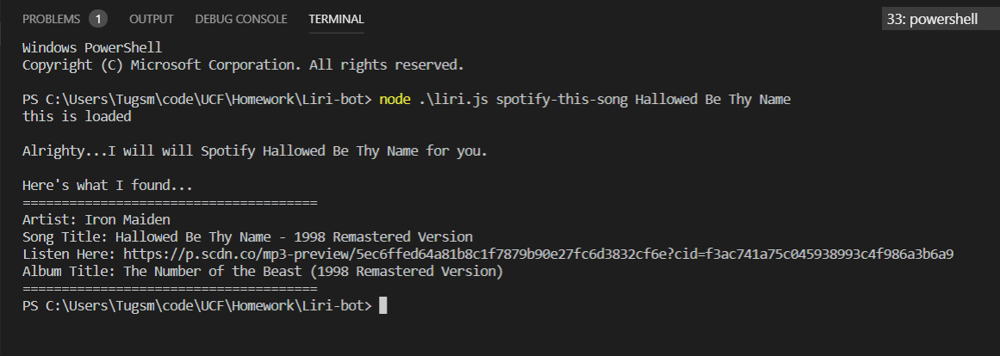
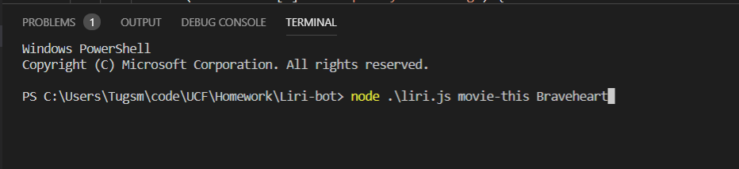
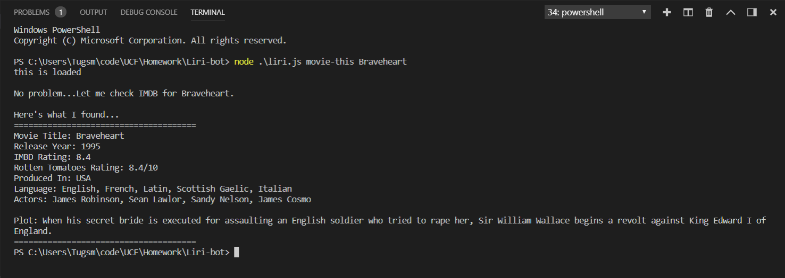
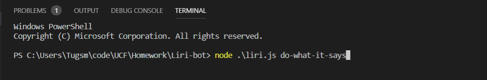
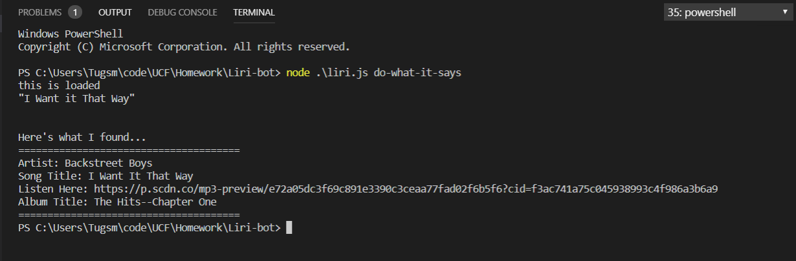

# Liri-bot
Node.js homework

## Overview
Liri-bot is a CLI application that allows the user to enter various commands into the command line to recieve different results.

The commands are listed below along with screen shots of how the commands are entered and what the various results will be displayed for the user.

## Before You Start
### NPM Packages
Before you start using Liri-Bot, make sure you install all the NPM packages or you will not be able to use this application effectively if at all.

### Please install...

##### Node Spotify API
In the command line type:

    npm i node-spotify-api

##### Request - Simplified HTTP client
In the command line type:

    npm i request

##### Moment
In the command line type:

    npm i moment

##### dotenv
In the command line type:

    npm i dotenv

And that is all for the npm packages.

## Liri-bot's Command Lines
Liri-bot has four different commands that will allow the user to send out four different requests and recieve data according to that particular request. Examples of how these commands work are posted in the command line examaple section of this readMe.

    The four different commands are:

        conert-this "artists name"
        spotify-this-song "song title"
        movie-this "movie title"
        do-what-it-says

*Side Note*

Do Not Include the "" when you enter in the artists name, song title, or movie title. 

The "do-what-it-says" does not need an argument (second entry), just hit enter.

## Command Line Examples

### concert-this
To use concert-this, simply type in the command line:

```
node ./liri.js concert-this artists name
```

An example of this can be seen in the picture below.



And when you run the command, Liri will display all up comming concert information for that artist, as shown below.




### spotify-this-song
To use spotify-this-song, simply type in the command line:

```
node ./liri.js spotify-this-song Hallowed Be Thy Name
```

An example of this can be seen in the picture below.



And when you run the command, Liri will display various information about that song, as shown below.



### movie-this
To use movie-this, simply type in the command line:

```
node ./liri.js movie-this Braveheart
```

An example of this can be seen in the picture below.



And when you run the command, Liri will several pieces of information about that movie, as shown below.




### do-what-it-says
To use do-what-it-says, simply type in the command line:

```
node ./liri.js do-what-it-says
```

An example of this can be seen in the picture below.



And when you run the command, Liri will read a separate file called random.txt, and run the contents through the appropriate command, as shown below.


